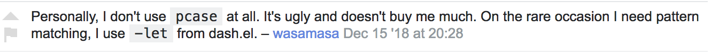

# Table of Contents

1.  [Introduction](#org39b6f27)
2.  [Installation](#org3f656ea)
3.  [What to expect?](#org5487df3)
4.  [Reference](#org875511b)
    1.  [multi-patterns](#orgc5f0895)
        1.  [mu-case](#org67649e5):macro:
        2.  [mu-prefer-nested-pcase](#org017588e):var:
        3.  [mu-defpattern](#org18299d4):macro:
        4.  [mu-pattern-documentation](#org11df1b6):procedure:
        5.  [built-in mu-patterns](#org5e8ed2e)
        6.  [predefined mu-patterns](#org77891d1)
        7.  [mu-let](#orgaf36bbb):macro:
        8.  [mu-when-let](#org525f67a):macro:
        9.  [mu-if-let](#org5b8e227):macro:
        10. [mu-defun](#org37151bd):macro:
        11. [mu-defmacro](#org849e8a1):macro:
        12. [mu (μ)](#orgb61773d):macro:
        13. [mu-function?](#org0493e9f):procedure:
        14. [mu-defsetter](#org6c2844b):macro:
    2.  [multi-structs and protocols](#orgfb8a418)
        1.  [mu-defprotocol](#orgfe2a9f5):macro:
        2.  [mu-extend](#org6145057):macro:
        3.  [mu-extends?](#orga5af5b9):procedure:
        4.  [mu-implements?](#orgd646854):procedure:
        5.  [mu-type?](#org6a75660):procedure:
        6.  [mu-defstruct](#orgc4e5188):macro:
        7.  [mu-table-protocol](#org91518b7):var:
        8.  [mu.slots (mu:slots)](#org8c7a620):procedure:
        9.  [mu.keys (mu:keys)](#orgad74538):procedure:
        10. [mu. (mu:)](#org2ee186f):procedure:
        11. [mu-equatable-protocol](#orgec231fe):var:
        12. [mu.equal](#orgff945e8):procedure:
        13. [mu-callable-protocol](#orge2a6d08):var:
        14. [mu.call (mu:call)](#orgd78387a):procedure:
        15. [mu.apply (mu:apply)](#org5656a32):procedure:
    3.  [multi-methods](#orgf0b10ae)
        1.  [make-mu-hierarchy](#orgcb4e023):procedure:
        2.  [mu-global-hierarchy](#orgcf62385):var:
        3.  [mu-active-hierarchy](#org73becfb):procedure:
        4.  [mu-with-hierarchy](#orgaa670e8):macro:
        5.  [mu-rel](#org9251203):macro:
        6.  [mu-isa?](#orgd0df80a):procedure:
        7.  [mu-ancestors](#orgd854bf0):procedure:
        8.  [mu-descendants](#org82088f2):procedure:
        9.  [mu-isa/generations?](#org20166a8):procedure:
        10. [mu-prefer](#orgbad111c):procedure:
        11. [mu-unprefer](#org4c67075):procedure:
        12. [mu-defmulti](#org38084e7):macro:
        13. [mu-defmethod](#org9a4ab6e):macro:
        14. [mu-undefmethod](#orgfc883f9):procedure:
    4.  [multi-benchmarks](#orgf1468a1)
        1.  [mu-bench-debug-print](#org7194975):var:
        2.  [mu-bench](#org8c31b69):macro:
        3.  [mu-bench\*](#org8da6207):macro:
        4.  [mu-bench/let](#org67b5d83):macro:
        5.  [mu-bench\*/let](#org40a5ed6):macro:
        6.  [mu-defbench](#org94410c9):macro:
        7.  [mu-defbench\*](#orgac4487a):macro:
        8.  [mu-bench/context](#org2fe1023):macro:

# Introduction

*multi.el* is a multiple dispatch library for Emacs Lisp. It adds support for

-   type-driven dispatch with *multi-protocols*,
-   ad-hoc polymorphism with *multi-methods*,
-   pattern-matching and destructuring without noise with *multi-patterns*,
-   case-dispatch with *multi-defuns*,
-   benchmarking all of the above with *multi-benchmarks*.

# Installation

> This is very much a *hacker release*, so I intentionally haven't published it on
> any package repositories. In truth I don't yet know how to do that. If you know
> your Elisp devops and want to see this project bundled properly, consider lending
> a hand.

For now, clone this repo and eval code as needed or load it from your *init.el*.

# What to expect?

*Please read this section carefully and manage your expections accordingly.*

> **Warning**: *hacker release* - not very user-friendly.

Little to no effort has been spared on optimization and performance. Even obvious
things, like caching dispatch in multi-methods, are missing. **This is
intentional**: any perf tuning requires careful and consistent measurments and
systematic approach to code changes not ad-hoc guesswork. To that effect I hope
I've set ourselves up for success by building *multi-benchmarks* that would turn
any optimization effort into productive activity. Check out [benchmarks.org](benchmarks.md) to see
*multi-benchmarks* in action (if reading on Github, choose RAW format) - it is an
executable ORG-file. That said *multi.el* is feature complete and you'll get what
the introduction has promised.

If you run into issues or want to contribute do yourself a favor and employ
*Edebug* extensively. *Edebug* is your friend because I took care to *edebug-spec*
most if not all macros. **So, fret not and step debug it!**

You can get both syntax-highlighting and appropriate *Imenu* entries for
*multi.el*. Have a look at [Font-lock & Imenu](multi-prelude.el) outline in *multi-prelude.el*.

All user-facing features and majority of private ones have been documented. In
fact this README along with the Reference below have been generated by **executing**
the [make-readme.org](make-readme.md) file, which can even extract and test the examples. Isn't
ORG-mode amazing! Check out the source if curious - I'm not really an ORG expert -
just playing around.

# Reference

## multi-patterns

Multi-patterns build on the venerable `pcase` macro to give you powerful yet clean
pattern-matching. No more `quote`, `unquote` all over the place.

We also provide `mu-defun` and `mu-defmacro` that extend their native counterparts
with the ability to pattern match on and destructure arguments. To a first
approximation this is syntactic sugar over function definition and `mu-case`
expression. `mu-defun` exists in two versions: *single-head* and *multi-head*,
where the former is like `defun` that also pattern matches on its arglist binding
any pattern-variables in the body, while the latter allows multiple clauses each
with its own arglist pattern and body. Multi-head defun is not unlike and has been
inspired by Clojure's multi-head `defn` but is strictly more expressive.

### mu-case     :macro:

    Like ‘pcase’ but uses mu-patterns for matching.

    ------------------------------
          E = sexp
    CLAUSES = (clause ...)
     clause = (pattern body ...)
            | (otherwise body ...)
    ------------------------------

    Any sequence []-pattern is treated strictly - must match the
    entire sequence to succeed.

Some basic examples. Note that `[pat ...]` is a sequence-pattern that will happily
match both lists and vectors.

    (should (equal '(2 [3 4]) (mu-case [1 2 3 4]
                                ((l a _ c)    (list a c))
                                ((v a _ c)    (list a c))
                                ([_ b | rest] (list b rest))
                                (otherwise    'no-match))))

### mu-prefer-nested-pcase     :var:

    ‘pcase’ expander may on occasion produce pathological
    expansions, where a reasonable 4-clause matcher expands into over
    160K lines of code. Toggling this parameter where this happens
    will force ‘mu-case’ to convert generated pcase-clauses into a
    tree of nested pcase-calls before handing it over to ‘pcase’.
    This shrinks the expansion by orders of magnitude but may defeat
    some optimizations ‘pcase’ could have undertaken had it known all
    the clauses (citation needed).

### mu-defpattern     :macro:

    Define an expander for a custom mu-pattern of the form (NAME
    &rest patterns) where actual patterns will be bound in the
    expander according to the ARGLIST. Expander must produce a valid
    mu-pattern. NAME is only required to identify the pattern, the
    macro does not bind it. Optional DOCSTRING maybe supplied to
    improve readability of your code. BODY may start with a :debug
    EDEBUG-SPEC attribute pair.

    (fn NAME ARGLIST &optional DOCSTRING &rest BODY)

For many examples see pre-defined custom patterns in [multi-patterns.el](multi-patterns.el)

### mu-pattern-documentation     :procedure:

    Extract docstring from custom mu-pattern NAME

### built-in mu-patterns

1.  ?-pattern     :pattern:

    Predicate pattern. Equivalent to `(pred function)` pcase-pattern.

        (should (eq 'match (mu-case 1
                             ((or (? zerop) (? oddp)) 'match))))

2.  lst-pattern     :pattern:

    List pattern. To match it must have the same number of patterns as elements in the
    list and every pattern must match. Unlike [l-pattern](#org4a96835) it does not allow matching
    tail of a list with `&rest`.

3.  vec-pattern     :pattern:

    Vector pattern. Like [lst-pattern](#orgad57b68) but matches vectors.

### predefined mu-patterns

1.  l-pattern     :pattern:

        mu-pattern to match lists. Unlike built-in lst-pattern allow a
        &rest subpattern to match remaining items.

        (should (equal '(2 3) (mu-case '(1 (2 3))
                                ((l _ (l a | tail)) (list* a tail)))))

2.  v-pattern     :pattern:

        mu-pattern to match vectors. Unlike built-in vec-pattern allow
        a &rest subpattern to match remaining items.

        (should (equal '(1 [2 3]) (mu-case [1 2 3]
                                    ((v x | tail) (list x tail)))))

3.  lv-pattern     :pattern:

        mu-pattern to match lists and vectors alike. Unlike
        seq-pattern it is strict and behaves like l-pattern for lists or
        v-pattern for vectors: must match the entire sequence to
        succeed.

4.  seq-pattern     :pattern:

        mu-pattern to match lists and vectors taking an open-world
        collection view: match as many PATTERNS as available. Fewer
        patterns than items in a sequence will simply match the head of
        the sequence; more patterns will match available items, then
        match any excessive patterns against that many nils. Supports
        &rest subpattern to match remaining items.

        (should (equal '(1 2 3) (mu-case [(1) [(2)] (3)]
                                  ([[a] [[b]] [c]] (list a b c)))))

    1.  mu-seq-pattern-force-list     :custom:

            Force seq-pattern to always cast its &rest submatch to a list.
            By default &rest submatch preserves the type of sequence being
            matched.

        Forcing `&rest` submatch to a list is primarily useful when one wants to capture
        the rest of the sequence and test whether its empty with a traditional `nil`
        check.

        Examples:

            (should (equal [] (mu-case []
                                ([| rest] rest))))

            (should (equal '() (let ((mu-seq-pattern-force-list 'list))
                                 (mu-case []
                                   ([| rest] rest)))))

            (should (equal '(1 ([2]) (3))
                           (let ((mu-seq-pattern-force-list 'list))
                             (mu-case [[1 [2]] 3]
                               ([[x | y] | z] (list x y z))))))

5.  ht-pattern     :pattern:

        mu-pattern for hash-tables, structs and alists.

        ------------------------------------------------
        PATTERNS = (key-pat ...)
         key-pat = id | keywordp | ’symbolp | (key id)
        ------------------------------------------------

        Keyword key-pat looks up :key then ’key in order binding value to
        variable ‘key’. Quoted symbol key-pat tries in order ’key then
        :key. (key id) looks up ‘key’ binding value to ‘id’ on success.

        (should (equal '(1 2 3 4) (mu-case (ht (:a 1) ('b 2) (:c 3) ('d 4))
                                    ((ht :a b 'c ('d D)) (list a b c D)))))

6.  ht|-pattern     :pattern:

        Mu-pattern for key-value sequence prefix. Try to match and
        collect sequence elements pair-wise as though they were elements
        of a hash-table. PATTERNS are key-patterns like in ht-pattern
        followed by an optional []-pattern to match the rest of the
        sequence.

        ------------------------------------------------
        PATTERNS = (key-pat ... [seq-pattern])
         key-pat = id | keywordp | ’symbolp | (key id)
        ------------------------------------------------

    Example:

        (should (equal '(1 2) (mu-case '(:a 1 :b 2 body)
                                ([| (ht| a b)] (list a b)))))

        (should (equal '(1 2 (body)) (mu-case '(:a 1 :b 2 body)
                                       ([| (ht| a b [| rest])] (list a b rest)))))

7.  id-pattern     :pattern:

        Mu-pattern for identifiers - symbols that maybe used as
        variable names. E.g. it wil not match ‘t’ or ‘nil’.

### mu-let     :macro:

    Like ‘let*’ but allow mu-patterns in binding clauses. Any
    pattern-variables bound during pattern matching will be available
    in the BODY.

    -------------------------------
    BINDINGS = ((pattern expr) ...)
             | ‘[’clause ...‘]’

      clause = pattern expr
    -------------------------------

    Any sequence []-pattern is permissive.

Note that in the example below []-pattern is permissive, so any extra
pattern-variables are bound to nil, any extra sequence values that have no
patterns to match are discarded:

    (should (equal '(1 2 nil 3 5 6) (mu-let (([x y z]  '(1 2))
                                             ([a]      '(3 4))
                                             ((ht b c) (ht (:b 5)
                                                           (:c 6))))
                                      (list x y z a b c))))

With patterns on the left traditional Lisp-style let-bindings become busy. This is
one case where an alternative Clojure-style let-syntax may be desirable. You may
surround let-bindings with [] to minimize leading open-parens, so previous example
becomes:

    (should (equal '(1 2 nil 3 5 6) (mu-let [[x y z]  '(1 2)
                                             [a]      '(3 4)
                                             (ht b c)  (ht (:b 5)
                                                           (:c 6))]
                                      (list x y z a b c))))

### mu-when-let     :macro:

    Like ‘when-let*’ but allow mu-patterns in binding clauses. See
    ‘mu-let’.

In the following example the second binding clause fails to match, so the body
never runs and the entire expression returns `nil`:

Example:

    (should-not (mu-when-let ((a 1)
                              ((l b) '(0 4)))
                  (list a b)))

### mu-if-let     :macro:

    Like ‘if-let*’ but allow mu-patterns in binding clauses. See
    ‘mu-let’.

Example:

    (should (equal '(1) (mu-if-let ((a 1)
                                    ((l b) '(0 4)))
                            (list a b)
                          (list a))))

### mu-defun     :macro:

    Like ‘defun’ but choose the body to execute by
    pattern-matching on the arglist. Clauses are tried in order as if
    multiple definitions of the same function NAME were defined.

    ------------------------------------
        ARGLIST = seq-pattern
                | _
                | id
                | (args ...)

       METADATA = [docstring] attr ...

           attr = :declare form
                | :interactive form
                | :before form
                | :after form
                | :return id
                | :setup form
                | :teardown form

           BODY = body
                | clause ...

         clause = (seq-pattern body ...)

    seq-pattern = ‘[’pattern ...‘]’
    ------------------------------------

    In addition to any pattern-variables bound by clause-patterns
    each body has ARGLIST variables in scope.

    In attribute options :declare takes a list of ‘declare’ specs;
    :interactive is either ‘t’ or an ‘interactive’ arg-descriptor;
    :return binds VAR to the result of BODY; :setup and :teardown
    execute their respective forms for side-effect before and after
    BODY. Both forms have ARGLIST bindings in scope, :teardown form
    has access to the VAR when :return is specified. To avoid before
    and after forms being executed on every recursive call use
    :before and :after attributes instead.

    In a single-head function ARGLIST must be a []-pattern. In a
    multi-head function ARGLIST that is an id will bind ARGLIST to
    that id; ARGLIST that is ‘_’ will be ignored; ARGLIST must be a
    ‘defun’ arglist otherwise.

    (fn NAME ARGLIST METADATA &rest BODY)

*Note for Clojure programmers*. Although inspired by Clojure the dispatch
semantics of `mu-defun` are more expressive. The following is not allowed in
Clojure:

    (defn foo
      ([a b c] ...)
      ([a b & pattern] ...))

nor can you dispatch on the same arity

    (defn foo
      ([a [b c] d] ...)
      ([a [b] c]   ...))

I see no reason for us to follow in Clojure footsteps and surrender expressiveness
afforded by patterns. *multi.el* takes the view that it is desirable to dispatch
not only on the arity but on the internal structure as well.

Note that dispatch on arity takes priority over destructuring and binding. To that
effect the outermost sequence pattern in both single-head and multi-head
`mu-defun` is strict, so it either matches the same number of elements as
arguments passed to it or fails and tries the next clause. In multi-head case
internal sequence-patterns are strict as well, so that one can dispatch on the
internal structure even if multiple clauses have the same arity; in a single-head
only the external []-pattern is strict so that calls with incorrect arity maybe
caught; internal sequence patterns, however, are permissive to fascilitate
destructuring. None of this is terribly important as long as it matches user
expectation which I hope it does.

Example: single-head `mu-defun`

    (mu-defun simple-foo [a [b [c]] | rest]
      (list* a b c rest))

    (should (equal '(:a :b nil) (simple-foo :a [:b])))

Examples: multi-head `mu-defun`

    (mu-defun foo-fun (&optional a b &rest args)
      "docstring"
      :interactive t
      ([_ _ x y] (list a b x y))
      ([_ _ x] (list a b x))
      ([_ _] (list a b))
      ([_] (list a b))
      ([] (list a b)))

    (should (equal '(:a :b 1 2) (foo-fun :a :b 1 2)))
    (should (equal '(:a :b 1)   (foo-fun :a :b 1)))
    (should (equal '(:a :b)     (foo-fun :a :b)))
    (should (equal '(:a nil)    (foo-fun :a)))

In addition to `:interactive` and `:declare`, whose semantics come directly from
`defun`, `mu-defun` takes several other options as attributes. `:return` lets one
bind the result to an identifier that will be in scope in code forms specified
with `:after` and `:teardown` attributes. More generally one can specify forms to
run immediately before and after the function's body. This is normally done for
side-effects. Think of `:setup` and `:teardown` as prep-work before the function
runs and clean up after. Both forms have function's arglist in scope. When
present, these forms run unconditionally every time the function is called. This
may lead to unexpected behavior when the same function is called recursively. To
avoid this use `:before` and `:after` forms instead. These will not be executed in
nested invocations.

Example:

    (mu-defun foo-with-setup [n]
      :return   ret
      :setup    (princ ":setup")
      :teardown (princ ":teardown")
      :before   (princ ":before")
      :after    (princ (format ":after %s" ret))
      (if (zerop n)
          0
        (foo-with-setup (1- n))))

    (should
     (equal ":before:setup:setup:teardown:teardown:after 0"
            (with-output-to-string
              (foo-with-setup 1))))

### mu-defmacro     :macro:

    Like ‘defun’ but choose the body to execute by
    pattern-matching on the arglist. Clauses are tried in order as if
    multiple definitions of the same function NAME were defined.

    ------------------------------------
        ARGLIST = seq-pattern
                | _
                | id
                | (args ...)

       METADATA = [docstring] attr ...

           attr = :declare form
                | :interactive form
                | :before form
                | :after form
                | :return id
                | :setup form
                | :teardown form

           BODY = body
                | clause ...

         clause = (seq-pattern body ...)

    seq-pattern = ‘[’pattern ...‘]’
    ------------------------------------

    In addition to any pattern-variables bound by clause-patterns
    each body has ARGLIST variables in scope.

    In attribute options :declare takes a list of ‘declare’ specs;
    :interactive is either ‘t’ or an ‘interactive’ arg-descriptor;
    :return binds VAR to the result of BODY; :setup and :teardown
    execute their respective forms for side-effect before and after
    BODY. Both forms have ARGLIST bindings in scope, :teardown form
    has access to the VAR when :return is specified. To avoid before
    and after forms being executed on every recursive call use
    :before and :after attributes instead.

    In a single-head function ARGLIST must be a []-pattern. In a
    multi-head function ARGLIST that is an id will bind ARGLIST to
    that id; ARGLIST that is ‘_’ will be ignored; ARGLIST must be a
    ‘defun’ arglist otherwise.

    (fn NAME ARGLIST METADATA &rest BODY)

### mu (μ)     :macro:

    Create an anonymous function, otherwise like ‘mu-defun’.

    (fn ARGLIST METADATA BODY...)

Examples:

    (should (equal
             '(1 2 3 4)
             (funcall
              (mu [a b | args] (list* a b args))
              1 2 3 4)))

    (let ((mu-lambda (mu (a &rest _)
                       ([_ b] (list a b))
                       ([_ b c] (list a b c)))))
      (should (equal '(1 2)   (funcall mu-lambda 1 2)))
      (should (equal '(1 2 3) (funcall mu-lambda 1 2 3))))

### mu-function?     :procedure:

    Like functionp but accounts for #’function and mu-lambda.
    Intended to be used at compile time on code objects. Not
    guaranteed to always do the right thing at runtime.

### mu-defsetter     :macro:

    Like ‘gv-define-setter’ but allow ‘mu-defun’ dispatch and
    destructuring.

## multi-structs and protocols

multi-structs.el implement *mu-structs* and *mu-protocols* that were loosely
inspired by *Clojure* records and [protocols](https://clojure.org/reference/protocols) and *Racket*'s structs and [generic
interfaces](http://docs.racket-lang.org/reference/struct-generics.html) although Racket doesn't allow delegation, so polymorphic it may be, but
not really what you come to expect from type dispatch.

*mu-structs* are built on top of Emacs Lisp cl-structs. Expect all of cl-struct
machinery to work. Mu-structs are defined with `mu-defstruct` and must inherit
either from the base type `mu-struct` (default) or one of its descendants. Unlike
cl-structs mu-structs are open maps that allow non-slot keys to be looked up and
set.

Protocols (sometimes called *generic interafaces*) allow type specialization of a
set of generic methods. Protocols are defined and assigned a set of methods with
`mu-defprotocol`. Structure types can implement protocols by reifying their
registered methods in `mu-defstruct` when a new struct type is being defined.
Alternatively protocol maybe extended to an existing type with `mu-extend`.

Protocol methods are effectively generic methods as implemented by `cl-defgeneric`
limited to single dispatch. Generic dispatch is performed on the type of the first
argument - what `cl-defmethod` documentation would call `(obj TYPE)` specializer.

Protocol implementations may reify several methods with the same name but
different arities. Apropriate method will be matched and invoked at dispatch.

We also implement and extend to existing types several useful protocols e.g.
`mu-table-protocol` allows one to query any associative data structure with the
same set of functions. For instance setting and querying a nested key in a
hash-table becomes as trivial as:

    (setf (mu. table :a :b :c) 42)
    (mu. table :a :b :c)

the above `setf` will even create nested hash-tables for intermediate keys that
are missing.

### mu-defprotocol     :macro:

    Combine a set of generic METHODS as protocol NAME.

    ----------------------------------------------------------
    NAME    = protocol-id

    METHODS = (method ...)

    method  = (defmethod method-id arglist [docstring] . rest)

    rest    = see ‘cl-defgeneric’
    ----------------------------------------------------------

    Bind variable NAME to the newly created ‘mu-protocol’ struct.
    Translate every method to a ‘cl-defgeneric’ (which see). Store
    arglists as metadata and for documentation but otherwise ignore.
    Tag every method-id symbol with a property :mu-protocol.

    Protocol METHODS are cl-generic functions that dispatch on the
    type of their first argument.

By convention protocol names are expected to have suffix `able` while protocol
variable created and bound by `mu-defprotocol` will have a compound suffix
`able-protocol` as in `mu-callable` vs `mu-callable-protocol`. So the following
definition

    (mu-defprotocol mu-callable-protocol
      (defmethod mu--call (f args)))

will bind variable `mu-callable-protocol` to a fresh `mu-protocol` struct whose
name is `mu-callable`. It will also register all methods that appear in the body
as cl-generic functions and part of the protocol. For the moment method arglists
are no more than metadata and won't effect how methods are reified or used.

The calling convention of previous paragraph is not enforced by implementation but
would make multi-method style `isa?` relations sound and read more natural. That
is any time a type implements a protocol a new relation is added to multi-methods
hierarchy of the form: TYPE isa PROTOCOLLABLE. For example:

    (mu-rel 'hash-table :isa 'mu-callable)

Establishing such relations from protocol implementations creates a bridge from a
more rigid style of dispatch sanctioned by protocols to a more ad-hoc style
offered by multi-methods. I.e. it should be possible to perform a multi-method
`type-of` dispatch on a protocol that would be satisfied by any type that
implements said protocol.

### mu-extend     :macro:

    Extend PROTOCOL to one or more existing types.

    ------------------------------------------------------------------------
      PROTOCOL = protocol-id

          TYPE = type-id

        method = (defmethod method-id [qualifiers] arglist [docstring] body)

       arglist = ((arg-id type-id) arg ...)
               | see ‘cl-defmethod’

    qualifiers = see ‘cl-defmethod’
    ------------------------------------------------------------------------

    Also register an ‘isa?’ relation between TYPE and protocol name
    as reported by (mu-protocol-name PROTOCOL) in the active
    multi-methods hierarchy. Do the same for each descendant of TYPE.

    To extend protocols to structs under your control consider using
    :implements option of ‘mu-defstruct’ instead.

    (fn PROTOCOL [:to TYPE method ...] ...+)

    (mu-extend mu-callable-protocol

      :to cl-structure-object
      (defmethod mu--call (obj args)
        (if-let ((f (or (get (type-of obj) :call) (mu. obj :call))))
            (apply f obj args)
          (apply #'mu. obj args)))

      :to hash-table
      (defmethod mu--call (obj args)
        (if-let ((f (ht-get obj :call)))
            (apply f obj args)
          (apply #'mu. obj args))))

### mu-extends?     :procedure:

    Check if PROTOCOL has been extended to TYPE

    (fn &key TYPE PROTOCOL)

### mu-implements?     :procedure:

    Check if OBJECT implements PROTOCOL

### mu-type?     :procedure:

    Check if symbol TYPE is tagged as a mu-type (inherits from
    ‘mu-struct’)

### mu-defstruct     :macro:

    Like ‘cl-defstruct’ but with mu-struct extensions.

    ------------------------------------------------------------------------
          NAME = struct-id
               | see ‘cl-defstruct’

          SLOT = slot-id
               | see ‘cl-defstruct’

      PROTOCOL =  protocol-id

        METHOD = (defmethod method-id [qualifiers] arglist [docstring] body)

       arglist = ((arg-id type-id) arg ...)
               | see ‘cl-defmethod’

    qualifiers = see ‘cl-defmethod’
    ------------------------------------------------------------------------

    Every mu-struct implicitly inherits from ‘mu-struct’ type. If
    :include struct property is present its value must be a type that
    ultimately inherits from ‘mu-struct’. Any other type will raise
    an error.

    Define extra predicate of the form NAME? as alias for NAME-p.

    Define NAME as a getter function for slots and keys of the
    struct. Make NAME a generalized ‘setf’-able variable (see ‘mu.’).
    In general mu-structs are open maps whose keys are not limited to
    slots. Generalized variables ‘mu.’ (or ‘mu:’) and NAME can be
    used to set slots or keys of a struct.

    Slots maybe followed by protocol implementations. Every protocol
    implementation starts with :implements attribute followed by
    protocol-name, followed by method implementations. Multiple
    methods maybe implemented for the same method-id but different
    arities. Since protocol methods dispatch on the type of their
    first argument every method will have the structure instance
    bound to it. Each method body implicitly binds every slot-id to
    its respective value in the structure instance.

    Set two properties on struct-id symbol :mu-type? tagging it as a
    ‘mu-struct’ and :mu-slots that keeps a list of all slot-ids.

    (fn NAME SLOT ... [:implements PROTOCOL METHOD ...] ...)

Every mu-struct is a cl-struct, so most cl-struct infrastructure should work as
expected. That includes constructing, getting and setting slots, etc.

    ;; define a new mu-struct
    (mu-defstruct foo-struct props)

    ;; define a new mu-struct that inherits from `foo-struct' and provides its own
    ;; (partial) implementation of two protocols
    (mu-defstruct (bar-struct (:include foo-struct))
      (name :bar)

      :implements mu-table-protocol
      (defmethod mu--get (obj key)
        (case key
          ('name name)
          ('props (bar-struct-props obj))))

      (defmethod mu--set (obj key val)
        (case key
          ('name (setf (bar-struct-name obj) val))
          ('props (setf (bar-struct-props obj) val))))

      :implements mu-callable-protocol
      (defmethod mu--call (f args) name))

    (setq bar (bar-struct-create))
    (setq foo (foo-struct-create))

    (should (bar-struct? bar))
    (should (foo-struct? bar))
    (should (mu-struct? bar))

`mu-defstruct` also defines a generalized-variable of the same name as struct
(`foo-struct` and `bar-struct` in our example) that can be used to get and set
struct slots and potentially deeply nested keys assuming the default
implementation of `mu-table-protocol` (see `mu.` function).

With a crude implementation of the protocol above we can set and get slots of a
bar-struct instance but not much more. Default implementation affords more power.
One can set values deep in the structure starting with its slots, or even set keys
that aren't slot. That is structs are treated as open maps.

    (setf (bar-struct bar 'name) :baz)
    (should (eq :baz (bar-struct bar 'name)))

    (setf (foo-struct foo :props :a 'b :c) 42)
    (should (eq 42 (foo-struct foo :props :a 'b :c)))

    (setf (foo-struct foo :not-a-slot) '())
    (push 42 (foo-struct foo :not-a-slot))
    (should (equal '(42) (foo-struct foo :not-a-slot)))

Notice that protocol methods implemented inside `mu-defstruct` have slots
explicitly defined (not inherited) in the struct definition in their lexical
scope. So, for instance, `mu--call` method above can refer to the current slot
value `name`.

### mu-table-protocol     :var:

    Protocol for table-like types. Define protocol methods
    ‘mu--slots’, ‘mu--keys’, ‘mu--get’, ‘mu--set’.

Table protocol makes working with map-like data easy. It provides unified
key-value interface, so when implemented for a custom type, keys can be looked up
and set in its instances with `mu.` (or `mu:`) function.

Table protocol has been extended to the following types: `hash-table`, `mu-struct`
and therefore to all structures created with `mu-defstruct`, `cl-structure-object`
and therefore to all structures created with `cl-defstruct`, `symbol`, `cons`,
`vector`.

*Last 3 of the listed types are experimental with access semantics not quite
worked out, but they should work for typical cases.*

### mu.slots (mu:slots)     :procedure:

    Return required keys in OBJ. OBJ must implement
    ‘mu-table-protocol’.

### mu.keys (mu:keys)     :procedure:

    Return all keys in OBJ. OBJ must implement
    ‘mu-table-protocol’.

### mu. (mu:)     :procedure:

    Look up KEYs in TABLE. Return nil if any KEYs missing. This is
    a generalized variable and therefore ‘setf’-able. TABLE must
    implement ‘mu-table-protocol’.

As previously mentioned one can use generalized variable defined by `mu-defstruct`
to lookup and set (potentially nested or missing) keys in a struct. `mu.` function
is a generalization of this idea that should work for any type that implements
`mu-table-protocol`, so that there's no need for type-specific functions that are
morally equivalent. This should aleviate the pain of having to use statically
defined struct slot accessors e.g. `foo-struct-name` or hash-table specific
`ht-get` for a single key look up, or `ht-get*` for multiple keys, etc.

`mu.` is also an attempt compress code without loss of information. It is not
uncommon to name local variables that hold struct instances so that one can
immediately deduce their type e.g. `foo` for a `foo-struct` instance. Even
generalized variables like `(foo-struct foo :props)` duplicate information and
introduce unnecessary noise in the code. Struct getters like `foo-struct-props` do
the same and are static. `mu.` offers a reasonably short alternative that works
for all major associative types.

    (setq foo (foo-struct-create :props (ht (:b 1))))
    (setq baz (foo-struct-create :props (ht (:a foo))))

    ;; look up a deeply nested key
    (should (eq 1 (mu. baz :props :a :props :b)))

    ;; mutate stored value
    (setf (mu. baz :props :a :props :b) 42)
    (should (eq 42 (mu. baz :props :a :props :b)))

    ;; create a new nested key
    (setf (mu. baz :props :a :props :new-key) 0)
    (should (zerop (mu. baz :props :a :props :new-key)))

To set nested keys `mu.` will create intermediate tables for any missing keys as
needed. So, the following example is morally equivalent to the one above:

    (setq baz (foo-struct-create))

    (setf (mu. baz :props :a) (foo-struct-create))
    (setf (mu. baz :props :a :props :b) 42)

    (should (eq 42 (mu. baz :props :a :props :b)))

### mu-equatable-protocol     :var:

    Protocol for deep equality. Define protocol methods
    ‘mu--equal’.

### mu.equal     :procedure:

    Test if OBJ1 and OBJ2 are of the same type and structurally equal.
    Unlike ‘equal’ perform deep equality comparison of hash-tables as
    values. Like ‘equal’ report nil when comparing hash-tables that
    have hash-tables as keys.

    (fn obj1 obj2)

### mu-callable-protocol     :var:

    Protocol for types that exhibit function-like behaviour.
    Define protocol method ‘mu--call’.

mu-callable protocol allows one to *invoke* instances of any type that implements
it as if they were procedures. Although this requires the use of API functions
`mu.call` and `mu.apply` in place of the native `funcall` and `apply`, the former
two effectively subsume the latter by delegating to them in the default case when
instance is already a function.

We implement this protocol for all structures (both mu-structs and cl-structs) as
well as hash-tables. Default implementation simply delegates to `mu.` to perform
key lookup:

    (setq foo (foo-struct-create))
    (setf (mu. foo :a :b) 42)

    (should (eq 42 (mu.call foo :a :b)))
    (should (eq 42 (mu.apply foo :a '(:b))))

One can override the default instance behaviour by setting a `'call` slot of a
struct (when available), a `:call` key of a hash-table or a mu-struct to a
function. This function will be applied instead of the default with the instance
passed as the first argument.

Or alter the behavior of the entire struct type by providing custom implementation
of the `mu-callable-protocol`.

*Inspired by Racket structs that can be made into procedures.*

### mu.call (mu:call)     :procedure:

    Like ‘funcall’ but invoke object F with ARGS. Unless F
    implements ‘mu-callable-protocol’ it is assumed to be a function
    and ‘funcall’ is used.

### mu.apply (mu:apply)     :procedure:

    Like ‘apply’ but apply object F to ARGS. Unless F implements
    ‘mu-callable-protocol’ it is assumed to be a function and ‘apply’
    is used.

## multi-methods

Multimethods bring ad-hoc multiple dispatch to Emacs Lisp. Multimethod combines a
dispatch function with an open set of methods each associated with a value. When
multimethod gets called its dispatch function, defined with `mu-defmulti`, is
applied to the arguments to compute a dispatch value. Dispatch mechanism then
checks which method, defined with `mu-defmethod`, has its value in an *isa?*
relatitonship with the dispatch value and runs that method. To a first
approximation isa-relation can be thought of as two values being equal or in a
parent-child or ancestor-descendant relationship. Semantics get more involved for
collections. Programmers not familiar with multimethods are referred to Clojure's
[Multimethods and Hierarchies](https://clojure.org/reference/multimethods) tutorial.

*Note for Clojure programmers*. This implementation takes a lot of inspiration
from Clojure, so for the most part you should feel right at home modulo some
syntactic differences. Naturally, Emacs Lisp type system is nothing like Clojure's
let alone Java's, so some of your programming patterns may require adjustment.

### make-mu-hierarchy     :procedure:

Create a new mu-hierarchy.

### mu-global-hierarchy     :var:

    Global hierarchy

### mu-active-hierarchy     :procedure:

    Return the hierarchy active in the current dynamic extent.

### mu-with-hierarchy     :macro:

    Prefer HIERARCHY during the dynamic extent of the body.

### mu-rel     :macro:

    Establish an isa relationship between CHILD and PARENT in the
    currently active hierarchy or HIERARCHY.

    (mu-rel CHILD REL PARENT [HIERARCHY])
    -------------------------------------
        CHILD = val
          REL = :isa | isa | any
       PARENT = val
    HIERARCHY = mu-hierarchy-p
    -------------------------------------

    REL argument is provided to help readability but is otherwise
    ignored.

Example:

    (mu-rel 'vector     :isa :collection)
    (mu-rel 'hash-table :isa :collection)

    (mu-defmulti foo #'type-of)
    (mu-defmethod foo (c) :when :collection :a-collection)
    (mu-defmethod foo (s) :when 'string :a-string)

    (should (equal :a-collection (foo [])))
    (should (equal :a-collection (foo (ht))))
    (should (equal :a-string (foo "bar")))

### mu-isa?     :procedure:

    Check if CHILD is isa? related to PARENT in the currently
    active hierarchy or HIERARCHY.

### mu-ancestors     :procedure:

    Return all ancestors of X such that (mu-isa? X ancestor) in
    the currently active hierarchy or HIERARCHY.

### mu-descendants     :procedure:

    Return all descendants of X such that (mu-isa? descendant X)
    in the currently active hierarchy or HIERARCHY.

### mu-isa/generations?     :procedure:

    Like ‘mu-isa?’ but return the generation gap between CHILD and
    PARENT.

    (fn X Y &optional (HIERARCHY nil) (GENERATION 0))

### mu-prefer     :procedure:

    Prefer dispatch value X over Y when resolving method FUN.

    (mu-prefer FUN ARGS ...)
    ------------------------
         FUN = id

    ARGS ... = val :to val
             | val :over val
             | val val
    ------------------------

    (fn fun x :over y)

Example:

    (mu-rel :rect isa :shape)

    (mu-defmulti bar #'vector)
    (mu-defmethod bar (x y) :when [:rect :shape] :rect-shape)
    (mu-defmethod bar (x y) :when [:shape :rect] :shape-rect)

    (should (mu--error-match "multiple methods match" (bar :rect :rect)))

    (mu-prefer bar [:rect :shape] :over [:shape :rect])
    (mu-prefer bar [:rect :shape] :over [:parallelogram :rect])

    (should (equal :rect-shape (bar :rect :rect)))

### mu-unprefer     :procedure:

    Remove registered preferences for FUN multi-dispatch function:

    (mu-unprefer FUN ARGS ...)
    --------------------------
         FUN = id

    ARGS ... = val :to val
             | val :over val
             | val val
             | val
             |
    --------------------------

    Called with a single VAL argument removes all preferences defined
    for the dispatch VAL; called with just FUN removes all known
    preferences for FUN.

    (fn foo x :over y)

### mu-defmulti     :macro:

    Define a new multi-dispatch function NAME.

    --------------------------------------------------
            ARGLIST = cl-arglist
                    | seq-pattern
                    | mu-function?

               BODY = [metadata] clause ...

             clause = body
                    | mu-defun-clause ...

           metadata = :hierarchy mu-hierarchy-p
                    | :static-hierarchy mu-hierarchy-p

    mu-defun-clause = (seq-pattern body ...)

        seq-pattern = ‘[’mu-pattern ...‘]’
    --------------------------------------------------

    ARGLIST maybe a CL-ARGLIST, a function (#’function, ‘lambda’,
    ‘mu’ lambda) or a sequence []-pattern. When ARGLIST is itself a
    function, BODY is ignored and that function is used to dispatch.
    ARGLIST and BODY combined may follow single-head or multi-head
    syntax to define a ‘mu-defun’ for dispatch and destructuring.

    BODY must return a value to be used for ‘mu-isa?’ dispatch.

See [mu-defmethod](#org9a4ab6e) for examples.

Unless either `:hierarchy` or `:static-hierarchy` attribute options are set
multi-dispatch defaults to `mu-global-hierarchy` to perform `mu-isa?` value
dispatch. One can switch dispatch to a custom hierarchy created with
`make-mu-hierarchy` by setting `:hierarchy` attribute to that hierarchy. Both
default and custom hierarchies can be overriden with `mu-with-hierarchy` for the
dynamic extent of its body. When such dynamic behavior is not desired set
`:static-hierarchy` attribute instead.

Example:

    (let ((hierarchy-1 (make-mu-hierarchy))
          (hierarchy-2 (make-mu-hierarchy)))

      (mu-defmulti bar #'identity :hierarchy hierarchy-1)
      (mu-defmethod bar (a) :when :parallelogram :parallelogram)
      (mu-defmethod bar (a) :when :shape         :shape)

      (mu-rel :rect isa :parallelogram hierarchy-1)
      (mu-rel :square isa :rect hierarchy-1)

      ;; should run with custom hierarchy-1
      (should (equal :parallelogram (bar :rect)))
      (should (equal :parallelogram (bar :square)))

      (mu-with-hierarchy hierarchy-2

        ;; should extend hierarchy-2
        (mu-rel :rect isa :shape)
        (mu-rel :square isa :rect)

        ;; should run with hierarchy-2 overriding hierarchy-1
        (should (equal :shape (bar :rect)))
        (should (equal :shape (bar :square))))

      ;; should be back to the custom hierarchy-1
      (should (equal :parallelogram (bar :rect)))
      (should (equal :parallelogram (bar :square))))

### mu-defmethod     :macro:

    Add a new method to multi-dispatch function NAME for dispatch
    value VAL.

    ----------------------------------------
            ARGLIST = cl-arglist
                    | seq-pattern
                    | mu-function?

               BODY = clause ...

             clause = body
                    | mu-defun-clause ...

    mu-defun-clause = (seq-pattern body ...)

        seq-pattern = ‘[’mu-pattern ...‘]’
    ----------------------------------------

    ARGLIST maybe a ‘cl-arglist’, a function (#’function, ‘lambda’,
    ‘mu’ lambda) or a sequence []-pattern. ARGLIST and BODY combined
    may follow single-head or multi-head syntax to define a
    ‘mu-defun’ for dispatch and destructuring.

Examples:

    ;; dispatch as a function
    (mu-defmulti foo #'vector)

    (mu-defmethod foo (a b) :when [:a :b] [:a :b])
    (mu-defmethod foo (a b) :when [:c :d] [:c :d])

    (should (equal [:a :b] (foo :a :b)))
    (should (equal [:c :d] (foo :c :d)))
    (should (mu--error-match "no mu-methods match" (foo :a :d)))

    ;; dispatch as a `defun'
    (mu-defmulti foo (&rest args)
      "docstring"
      :hierarchy mu-global-hierarchy
      (apply #'vector args))

    (mu-defmethod foo (a b) :when [:a :b] [:a :b])
    (mu-defmethod foo (a b) :when [:c :d] [:c :d])

    (should (equal [:a :b] (foo :a :b)))
    (should (equal [:c :d] (foo :c :d)))

    ;; single-head `mu-defun' style dispatch
    (mu-defmulti foo [_ [arg]]
      "docstring"
      arg)

    ;; simple `defun' style methods
    (mu-defmethod foo (a b) :when 1 1)
    (mu-defmethod foo (a b) :when 2 2)

    (should (eq 1 (foo 0 [1])))
    (should (eq 2 (foo 0 [2])))
    (should (mu--error-match "no mu-methods match" (foo 0 [3])))

    ;; `mu' lambda dispatch
    (mu-defmulti foo (mu [_ [arg]] arg)
      "docstring"
      :hierarchy mu-global-hierarchy)

    ;; single-head `mu-defun' style method
    (mu-defmethod foo [[a] _] :when 1 (list a))
    ;; `mu' lambda method
    (mu-defmethod foo (mu [[a b] _] (list a b)) :when 2)

    (should (equal '(a) (foo [a] [1])))
    (should (equal '(a b) (foo [a b] [2])))

    ;; multi-head `mu-defun' style method
    (mu-defmethod foo (a b) :when 2
      ([[a] _] (list a))
      ([[a b] _] (list a b)))

    (should (equal '(a) (foo [a] [1])))
    (should (equal '(a b) (foo [a b] [2])))

    ;; multi-head dispatch
    (mu-defmulti foo (&rest args)
      "docstring"
      :hierarchy mu-global-hierarchy
      ([a] a)
      ([a b] b))

    (mu-defmethod foo (&rest args) :when 1 1)
    (mu-defmethod foo (&rest args) :when 2 2)

    (should (eq 1 (foo 1)))
    (should (eq 2 (foo 1 2)))

Multi-methods allow a catch-all default method that runs when dispatch fails.
Pre-installed default simply signals that no matching methods have been found.

Example: default method

    (mu-defmulti foo #'identity)
    (mu-defmethod foo (x) :when :a :a)

    ;; pre-installed default method fires
    (should (mu--error-match "no mu-methods match" (foo :c)))

    ;; user-defined default method
    (mu-defmethod foo (x) :when :default :default)
    (should (equal :default (foo :c)))

    ;; no longer default when dispatch val gets a method
    (mu-defmethod foo (x) :when :c :c)
    (should (equal :c (foo :c)))

### mu-undefmethod     :procedure:

    Remove multi-method for FUN and dispatch value VAL

## multi-benchmarks

> Although bundled together with all things *multi*, benchmarks may actually belong
> in a package of their own.

Multi-benchmarks is a series of macros to measure execution time of arbitrary
code. Code is byte-compiled before any such measurment is taken. Whenever possible
library functions attempt to account for any overhead they introduce. Measurements
are reported as lists that ORG-mode recognizes as tables. This makes comparing,
tracking, visualizing and sharing performance stats in an ORG file very
convenient.

Please see [./benchmarks.org](benchmarks.md) in this repository for how multi-benchmarks can
leverage ORG-mode to measure and track real code performance.

Examples:

    (example

     (mu-bench :times 3 (princ (+ 1 2)))

     (let ((mu-bench-debug-print 2))
       (mu-bench*
        :times 3
        :compare t
        (mu-bench "1" (+ 1 2))
        (mu-bench/let ((a 1)) "2" (+ 1 a))))

     (mu-bench*/let ((a 0)
                     (b 1))
       :times 3
       :compare t
       (mu-bench "1" (princ (+ a b)))
       (mu-bench/let ((a 1)) "2" (princ (+ a b))))

     (mu-defbench bar-bench (a b)
       :times 3
       (princ (+ a b)))

     (bar-bench 1 2)

     (mu-defbench* foo-bench (a b)
       :times 3
       :compare t
       (mu-bench :name "1" (princ (+ a b)))
       (mu-bench/let ((a 1)) :name "2" (princ (+ a b))))

     (foo-bench 0 1)

     (let ((mu-bench-debug-print 2))
       (mu-bench/context
           ;; benchmark
           (mu-bench/let ((a 1) (b 2))
             :times 3
             (list (foobar) (barfoo) a b))
         ;; context
         (defun foobar () 'foobar)
         (defun barfoo () 'barfoo)))
     ;; example
     )

### mu-bench-debug-print     :var:

    t or NUMBER. When in scope every mu-bench will accumulate that
    many results and pretty-print to STDOUT. ‘mu-bench/context’ will
    pretty-print its entire context in a temporary *mu-bench-context*
    buffer.

### mu-bench     :macro:

    ‘benchmark-run-compiled’ BODY that many TIMES. Unless RAW is
    requested collect results into an ORG-ready table with headings.

    (mu-bench [DOC] ATTR-OPTION ... BODY)
    -------------------------------------
            DOC = stringp

    ATTR-OPTION = :name stringp
                | :times numberp
                | :raw boolean

           BODY = code ...
    -------------------------------------

    TIMES defaults to 10’000. RAW defaults to nil. Unless NAME
    attribute is supplied DOC is used to identify the benchmark in
    statistics produced.

    (fn &optional docstring &key name times raw &rest body)

### mu-bench\*     :macro:

    Like ‘mu-bench’ but BODY must be a sequence of mu-benches to
    run.

    (mu-bench* [DOC] ATTR-OPTION ... BODY)
    --------------------------------------
            DOC = stringp

    ATTR-OPTION = :times numberp
                | :raw boolean
                | :compare boolean

           BODY = bench ...

          bench = ‘mu-bench’
                | ‘mu-bench/let’
    --------------------------------------

    When COMPARE is t report performance relative to the benchmark
    that shows the best time, sort benchmarks table by relative
    performance fastest to slowest.

    (fn &optional docstring &key times raw compare &rest mu-benches)

### mu-bench/let     :macro:

    Like ‘mu-bench’ but with additional bindings in VARLIST
    available in BODY.

    -------------------------
    VARLIST = ((id expr) ...)
    -------------------------

    (fn varlist &optional docstring &key name times raw &rest body)

### mu-bench\*/let     :macro:

    Like ‘mu-bench*’ but with additional bindings in VARLIST
    available in BODY.

    -------------------------
    VARLIST = ((id expr) ...)
    -------------------------

    (fn varlist &key times raw compare &rest mu-benches)

### mu-defbench     :macro:

    Like ‘mu-bench’ that can be called by NAME with variables in
    ARGLIST in scope.

### mu-defbench\*     :macro:

    Like ‘mu-bench*’ that can be called by NAME with variables in
    ARGLIST in scope.

### mu-bench/context     :macro:

    Run MU-BENCH with additional CONTEXT compiled and loaded as
    ‘progn’ before MU-BENCH. Semantically it is as if one wrote
    CONTEXT code followed by MU-BENCH in a file, byte-compiled then
    loaded it.

    --------------------------------------
    MU-BENCH = ‘mu-bench’ | ‘mu-bench/let’
    CONTEXT = body
    --------------------------------------
